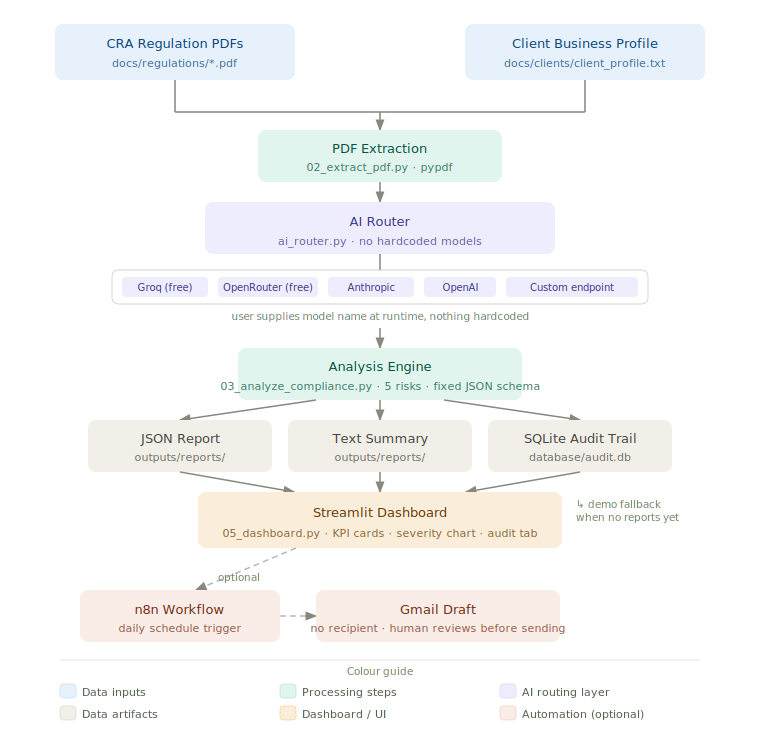

# Case study: Compliance Automation Engine

**Arun Prabakar Vadaseri Rajendran**
Live demo: https://compliance-automation-engine.streamlit.app/
Code: https://github.com/PrabaAP/compliance-automation-engine
AI tools used: Google Stitch (UI design), Claude Code (script implementation), Perplexity (research and competitive analysis)

*This case study is written for technical leaders and partners evaluating AI-assisted compliance workflows in Canadian accounting and advisory firms.*

---

## The problem

Accounting firms doing compliance work for Canadian clients follow roughly the same manual process for every file. Someone pulls the relevant CRA bulletins, reads through them, compares them against what they know about the client's business, and writes up what looks risky. For a firm with 20 active clients, that's a significant amount of billable time going toward a task that follows the same pattern every time.

The miss rate matters too. A tired reviewer skips a section. A junior staff member doesn't know which CRA reference applies to a holding company structure. The first pass is where things fall through, not the final review.

I came from professional services work and had seen this process up close. I wanted to know if an AI pipeline could handle that first pass reliably enough to be useful.

---

## Who this is for and what it does not do

This tool is for Canadian accounting and advisory firms doing CRA compliance review for SME clients. It handles one specific task: the first-pass read of CRA regulatory PDFs against a client business profile.

It does not do tax preparation, handle CASL or PIPEDA compliance, or produce advice that replaces a CPA's judgment. The output is a **triage document**. Every result needs professional review before it touches a client file or goes to a client.

This also positions it differently from broader Canadian compliance platforms covering CASL, PIPEDA, or ESG, and from general AI accounting suites focused on bookkeeping or GL automation. The scope is narrow by design: CRA bulletin-level compliance risk for SME clients, surfaced for professional review.

---

## Outcome snapshot

Run the pipeline on a new client file and you have a five-point risk checklist in under a minute. Each item has a severity level, the exact CRA reference, the specific reason this client is exposed, and one concrete next step. A Gmail draft of the client communication lands in your Drafts folder with no recipient set, ready for you to review and send when ready. Every run is logged to a SQLite audit trail. Nothing goes out automatically.

---

## Design decisions made before writing any code

Two constraints shaped everything that followed.

**No hardcoded models.** Whoever uses this tool should be able to type in whatever model they want. If Anthropic ships a new version next month, or if a firm already has a Groq key they're comfortable with, the tool should work without touching the code. This meant building a provider router rather than just calling one API directly.

**No credentials stored.** API keys live in session state only. Gone when the browser tab closes. Nothing in `.env`, nothing in the repository.

Both of these came from the same instinct: build something that holds up as models and providers change around it.

---

## Governance and controls

The design aligns with how CPA Ontario and CSQM 1 expect firms to use AI: the tool does the triage work, the engagement partner owns the conclusions.

**Audit trail.** The SQLite audit row logs provider, model name, PDFs read, date, client file, and risk count per run. This supports documented AI use within CSQM 1 engagement quality requirements, where technology use in client work needs to be logged and reviewable.

**Human sign-off.** The Gmail draft has no "To" field. It exists to reduce drafting time, not to send without review. The engagement partner decides what goes to the client.

**Data handling.** CRA regulatory PDFs are public documents. Client business profiles contain potentially sensitive information. Firms can anonymize or redact client profiles before running them through the pipeline. Connecting the tool to a **firm-controlled model endpoint** (Azure OpenAI with Canadian data residency, a self-hosted model, or any OpenAI-compatible endpoint the firm manages) keeps client data within the firm's own infrastructure. The architecture supports this because no specific provider or endpoint is hardcoded.

**This does not satisfy PIPEDA or AIDA compliance review by itself.** The firm remains responsible for how it deploys the tool and for any advice that flows from it.

---

## Architecture



```
CRA regulation PDFs          Client business profile (.txt)
       |                                  |
       v                                  v
 02_extract_pdf.py              (read directly by pipeline)
 (extract + combine PDF text)
       |                                  |
       +------------------+---------------+
                          |
                          v
           03_analyze_compliance.py
           (build prompt, call AI via ai_router, parse JSON)
                          |
            +-------------+-------------+
            |             |             |
            v             v             v
       JSON report    text summary   audit row
       (outputs/      (outputs/      (database/
        reports/)      reports/)      audit.db)
                          |
                          v
           05_dashboard.py (Streamlit UI)
           KPI cards, severity chart, risk cards
                          |
              (demo fallback: data/demo_report.json
               loads when outputs/reports/ is empty)
                          |
                          v  (optional, via n8n)
           Gmail Draft saved, no recipient set
```

---

## How each part works

### PDF extraction (`02_extract_pdf.py`)

Reads every PDF in `docs/regulations/` page by page using pypdf. Pages are joined with a source header so the AI knows which regulation each passage came from. Encrypted PDFs are skipped with a warning. The result is one combined string passed directly to the analysis step. No chunking, no vector database. The full regulatory context goes to the model in one prompt, which is fine for the document sizes typical in accounting firm work and keeps the architecture simple.

### Provider router (`ai_router.py`)

All AI calls go through a single function: `call_ai(prompt, provider, api_key, model, custom_base_url)`. Groq, OpenRouter, OpenAI, and any custom endpoint use the OpenAI SDK with a base URL override, since they share the same chat completions format. Anthropic uses its own SDK. Model names are not stored anywhere in the config. The user supplies the model name at runtime through the dashboard, which passes it through to every script as a command-line argument.

### Analysis engine (`03_analyze_compliance.py`)

Builds a structured prompt that sets the AI's role as a senior compliance auditor, injects the combined PDF text and client profile, and specifies exactly five risks in a fixed JSON schema: title, severity, CRA reference, client exposure, and one concrete action. The response is parsed with `json.loads()`, with a fallback that strips markdown code fences for models that wrap their output despite being told not to. Results save as a JSON report, a plain-text summary, and an audit row in SQLite.

### Dashboard (`05_dashboard.py`)

Designed in Stitch, then built with Claude Code. The sidebar handles two steps: connect your AI (provider, model name, API key), then upload a client profile and run the analysis. The main area shows three KPI cards at the top, a horizontal Plotly bar chart with bars coloured by severity, and a styled card per risk with the CRA reference and recommended action. A three-way light/auto/dark toggle sits at the bottom of the sidebar. Auto reads the OS preference.

If `outputs/reports/` is empty, the dashboard loads `data/demo_report.json` and shows a blue banner noting that demo data is active. The live Streamlit Cloud link uses this to show anyone a fully populated dashboard with no API key required.

### n8n automation

A five-node workflow runs on a daily schedule. It calls the pipeline, reads the latest summary file, sends it to any OpenAI-compatible API to draft a client email, and saves the result to Gmail Drafts via OAuth2. The draft has no recipient. You open it, add the client's email address, review the content, and send when ready.

---

## Known limits and validation

The pipeline returns exactly five risks because that is what the prompt specifies. This is a deliberate choice, not a guarantee that only five issues exist or that all five are equally material.

Manual review of sample outputs against CRA bulletins showed two common failure modes: conservative over-flagging of low-probability exposures that are technically valid but unlikely for a specific client type, and occasionally missing niche rules that apply to industry-specific entities outside the most common SME structures.

In one test against a sample profile for a construction services firm (NAICS 23), the engine correctly flagged GST/HST subcontractor payment obligations and SR&ED credit documentation requirements, both of which matched the reviewer's notes. It missed a niche rule around specified investment business classification that only surfaced in the follow-up pass. That is a reasonable first-pass result and exactly the kind of gap the validation pilot is designed to measure.

Both of these are reasons why the output is a starting point for professional review, not a checklist to send to a client as-is. The tool does the first pass. The CPA does the judgment work.

The next validation step is a pilot with anonymized SME client files, measuring how often the five flagged risks match what a senior reviewer would have surfaced manually, and where the gaps are.

---

## Demo outputs

The demo client is Meridian Advisory Group Inc., a fictional mid-size advisory firm. The pre-built report shows five compliance risks, each with severity, CRA reference, client-specific exposure, and a recommended action. All five render in the dashboard with the full chart and KPI cards visible.

For a real run: connect a Groq key (free, no card), upload a `.txt` client profile, click Analyse Now. The pipeline returns in under a minute for typical PDF sets. The JSON report and text summary land in `outputs/reports/`. The SQLite audit row records the date, client file, provider, model, number of PDFs read, and risk count.

The next evolution of this section will document a pilot with real anonymized client files and partner-reviewed outputs. Until that data exists, the demo shows the interface and pipeline mechanics, not validated outcomes.

---

## What I learned

Getting consistent, machine-readable JSON out of different providers was the main prompt engineering problem. Fixing the output at five risks and specifying the exact schema in the prompt solved most of it. The fallback parser handles the remaining edge case where a model wraps its output in triple backticks.

The provider router turned out to be the right call for a different reason than I expected. Three providers I tested during development changed their free tier limits or renamed models during the build. Because nothing is hardcoded, none of that required a code change. The architecture held up on its own.

Building the UI in Stitch first and then handing off to Claude Code was a better workflow than I expected. Having a real design spec made the implementation faster and kept the CSS from becoming a mess of ad hoc overrides.

---

## What's next (Phase 2)

Phase 2 moves the tool from reactive to proactive. Currently you analyze a file when you ask for it. Phase 2 surfaces a new CRA bulletin before the client asks about it.

**CRA update monitoring.** Watch specific pages on CRA.gc.ca for content changes: the "What's New" bulletin page, technical interpretations index, and selected GST/HST and income tax notices. A lightweight HTML change detector or RSS monitor would flag new or updated content and feed it into the pipeline automatically.

**NAICS-to-risk mapping.** Client profiles would include a NAICS code and revenue bracket. When a new CRA bulletin is flagged, the system checks which NAICS codes and revenue ranges the update affects, using Statistics Canada and CRA's own NAICS reference tables as the lookup structure. Only clients likely to be impacted get flagged.

**Regulatory radar tab.** A new dashboard tab would show recent CRA updates, the clients they affect, and a button to run a targeted analysis for each. High-severity flags could trigger the n8n workflow to create Gmail drafts proactively.

This is where the Canadian regulatory specificity matters. Matching CRA updates to client types by NAICS code requires knowing how the Canadian industry classification maps to CRA compliance areas. That is not something you can lift from a generic AI accounting tool.

---

*Compliance Automation Engine · Arun Prabakar Vadaseri Rajendran*
*[linkedin.com/in/arun-prabakar-vadaseri-rajendran](https://www.linkedin.com/in/arun-prabakar-vadaseri-rajendran)*
